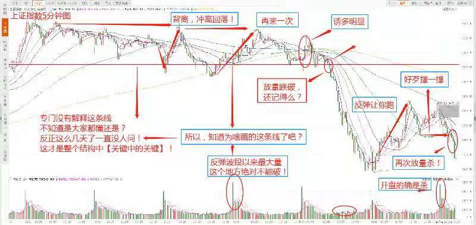

背离，支撑和钝化是时常出现的，因为技术的失准性，所以会出现各种情况。

**背离**：一般是指k线走势偏离指标的一种反常状态，一般的背离有macd背离，量价背离，KDJ背离，MFI背离等。除了macd外，其他指标基本都跟随K线上下波动，只有当K线形态不断创新高时，相应的指标却没有跟上，即发生了背离，一般形态有顶背离和底背离，当所有指标都发生了背离形态时，即共振背离，此时见顶和见底信号不远了，意味牛市或者熊市将发生转折。共振背离适用于所有股票。

**钝化**：上升趋势中，会出现相应的平台，K线进行箱体震荡阶段，当背离不成时，无效背离，形成钝化形态，此时当前指标暂时失效。

例如：茅台日线图，mack出现背离形态，但是占上新的高点，出现加速上涨行情

**量价背离**： **正常**的量价结构，价涨量增，价跌量缩，**不正常**的量价结构，价涨量缩，价跌量增。

### 趋势-支撑-压力

