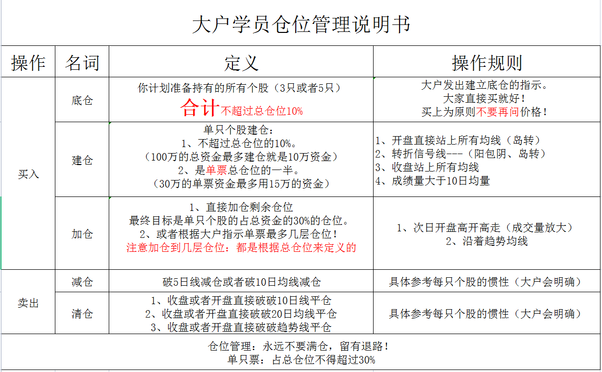

### 仓位管理

无论炒股水平如何，最重要的应该就是仓位管理了，外因很复杂，良好的仓位控制会永远有后路可以退。耐得住寂寞也是非常重要，人的情绪经常会因为贪心而忽视风险，也会判断错误。千万不要让自己无路可退，因为这就像开车一样，`all-in`就像油门踩到底，或许这会带来很好的收益，也会让人兴奋，可是一旦出现失误，就会造成无法挽回的损失，永远记得留给自己一条退路。

技术不是一天形成的，资金也不是一天积累的，幸苦积累的资金不要用于一场赌博。毕竟市场里永远有机会，每天都有涨停版，每天都有人赚钱也有人亏钱，这是常态。在这个市场一直存在下去，或许更有意义。

### #底仓

不用太在意别的票赚了多少，赚认知内的钱就好，当你认知越高，熟悉的票越多，对市场的把握越好时，收益自然会慢慢跟上。好好种下一颗种子，等待花园里的花慢慢开花结果，外面的花开的再艳丽，有的也会带刺。当然，所选的种子既是你挑选出来的股票，你需要对这只票的基本面进行分析，至少至少不能业绩太差吧，看一下那些涨的很高的票，一般基本面都很好，盈利很好，只有有价值的票才能业绩长牛。

【规则】

**所选的需要持有底仓的票(3，5只)**，太多的票会让你看不过来，每只票买入**一到两手**就好，**合计**不超过总仓位的**10%**，主要目的是**持续观察**，底仓位置没有强制要求。买点最好买在主力进货阶段，或者箱体震荡区间的下檐部分，或者出现转折信号的时。

### #建仓

* 单只个股不超过总仓位的**10%**

* 单只票总仓位的一半（30w的单票资金最多用15w）

  这两个条件满足其中一个即可，不必全部满足。

【买点】

* 开盘跳空直接站上所有均线（岛转）

* 转折信号线（刺透形态，岛转）

* 收盘站上所有均线

* 成交量大于10日均量

  所满足的形态条件越多，成功率越高。

形态兵法里会有详细介绍岛转，刺透形态等转折信号，底仓是为了持续关注这只票，是探路的侦察兵，建仓是找到合适的买点位置。如果建仓后不符合预期，主力还要继续洗盘，那就需要破线走人。

因为技术的延后性，所以主力到底是洗盘还是骗炮，需要等待市场快收盘时验证，这个需要一点盘感，不太好判断。一般破5日线便需要减仓

### #加仓

* 直接加剩余仓位，最终占**总资金**的**30%**，仓位的控制主要看个人承受风险的能力，一定要预留后退的余地，可以通过做T降低成本等。

【买点规则】

* 次日开盘高开高走（成交量放大）
* 沿着趋势线

### #减仓

* 破5日线或10日线减仓，具体参考个股的惯性，或者出现转折信号减仓

### #清仓

* 收盘或者开盘直接破10日线平仓
* 收盘或开盘破直接破20日线平仓
* 收盘或者开盘直接破所有趋势线平仓

以后会有说明出现顶背离，破位，形态兵法等转折信号，具体平仓位置需根据当下情况，每一个人对市场的理解和盘感是不一样的，这个需要时间的积累。 

良好的仓位有利于止损和获利，避免不必要的情绪交易，附仓位管理说明截图。

